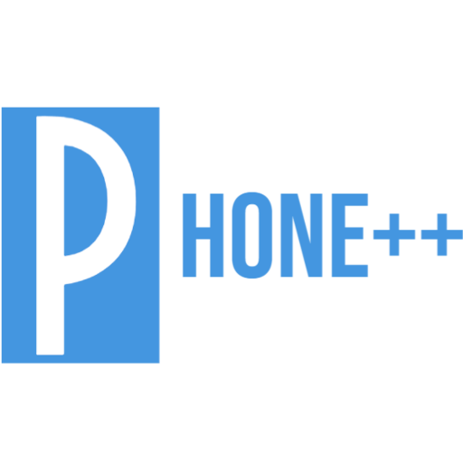

## Prerequisite
In order to build, code & run this project properly, you should have:
* NodeJS LTS [Gallium - v16](https://nodejs.org/en/download/).
* An IDE: VSCode, IntelliJ, or anything else based on your preference.
  <!--* A healthy mind in a healthy body.-->
* Yarn 1.22+

<!--Recommended plugins:
 * VSCode:
   * `esbenp.prettier-vscode`
 * JetBrains IDE:
   * [Prettier](https://plugins.jetbrains.com/plugin/10456-prettier) 
   ([Setup guide](https://prettier.io/docs/en/webstorm.html)).
-->

## How to run
```shell
# Get yarn if you don't have it already
npm i -g yarn

# Install, then start the dev server
yarn
yarn start

# then go to localhost:3000
```

## Project structure
Heavily inspired by [the architecture of bulletproof-react](https://github.com/alan2207/bulletproof-react/blob/master/docs/project-structure.md) 
```
src
├── assets:     contain all the static files such as images, fonts, etc.
├── components: shared components across the application.
├── features:   feature-based modules.
│   └── <<feature>> 
│       ├── assets:     static files of a specific feature.
│       ├── components: component scoped to a specific feature.
│       ├── hooks
│       ├── routes:     route component for a specific feature pages.
│       ├── stores:     state stores for a specific feature.
│       ├── utils
│       └── index.js
├── hooks:      shared hook functions across the application.
├── routes:     route configurations.
├── stores:     global state stores.
└── utils:      shared utility functions.

```

## Screenshots
TODO